# elmproject
# 说明

#####  三个月前，进入新公司，要求学vue,之前都是ng,学习了半个月后，写了一些demo,个人感觉综合性不强，开发完公司的项目口，想进一步提升自己，于是就再github上搜索了一下vue,于是就有了下面的故事。
#####  该项目借鉴与github原作者 bailicangdu 共享的elm项目，所有的静态数据资源拷贝原作者的数据，所有页面都属于本人亲自编写，如果您es6的相当熟悉，如果您的代码功底很好，那么就请你学习原作者的代码 [地址在这里](https://github.com/bailicangdu/vue2-elm.git), 如果您是初学者，或者有一定的基础，那么我想该醒目对你将会有一定的帮助

#### __注：此项目纯属个人为了提高对vue的学习而写的，属于模仿，但不是抄袭。__

##  最后在这里给大家分享一下福利，原作者建了一个qq群，群号为 582447162


## 技术栈
vue2 + vuex + vue-router + webpack + ES6/7 + axios + less + flex + svg

## 效果显示

#### 城市选择及登陆
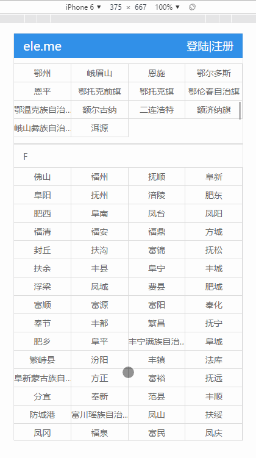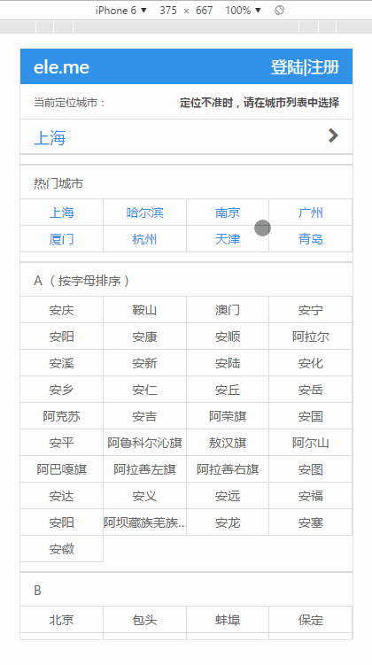

#### 商家菜单及购物车
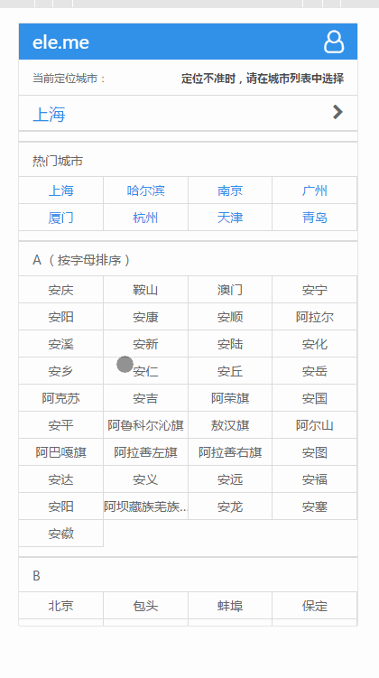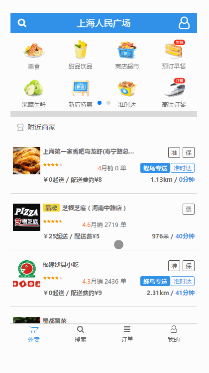

#### 搜索和订单页
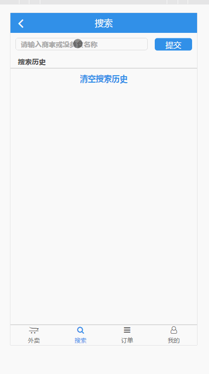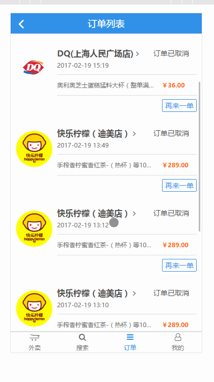

#### 确认订单和重置密码
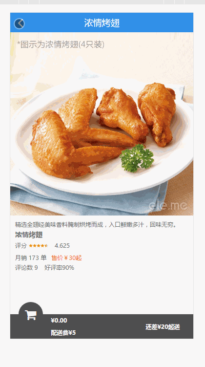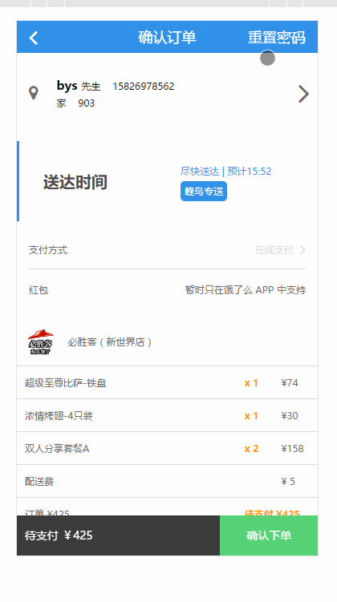

#### 个人中心和添加地址
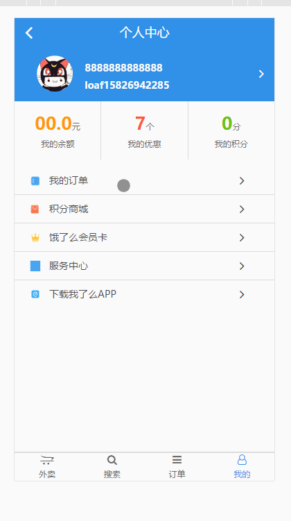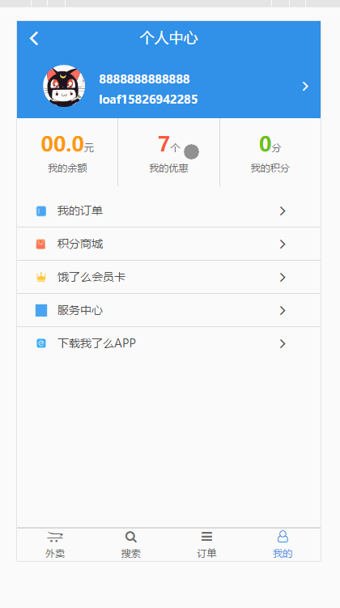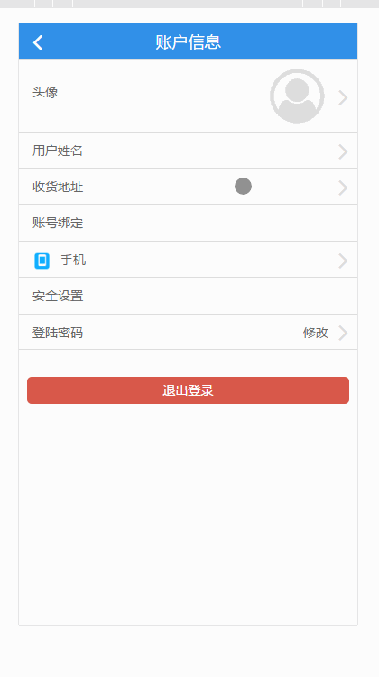

## 项目运行

##### 温馨提示：由于该项目大量使用的ES6新特性，nodejs必须是较新的版本(6.0以上)，建议使用稳定版本

* git clone https://github.com/15826954460/elmProject
* cd nodejs
* npm/cnpm install
* npm/cnpm run dev

## 效果演示

#### (项目部署服务器出了问题，接下来会补上);


## 附言

>  本项目主要用于熟悉如何用 vue2 架构一个大型项目

>  如果对您有帮助，您可以点右上角 "Star" 支持一下 谢谢！ ^_^

>  开发环境 Chrome 56  nodejs 6.10.0

>  另外一个 vue2.0仿nodejs中文社区的项目，比当前项目简单，适合初学者学习。
###### 地址在这里 [(https://github.com/15826954460/nodejs)]
###### demo [http://demonodejs.applinzi.com]

## 目录结构（布局）
- [x] 选择城市 -- 完成
- [x] 搜索地址 -- 完成
- [x] 展示所选地址附近商家列表 -- 完成
- [x] 搜索美食，餐馆 -- 完成
- [x] 餐馆食品列表页 -- 完成
- [x] 购物车功能 -- 完成
- [x] 店铺评价页面 -- 完成
- [x] 单个食品详情页面 -- 完成
- [x] 商家详情页 -- 完成
- [x] 登录、注册 -- 完成
- [x] 修改密码 -- 完成
- [x] 个人中心 -- 完成
- [x] 下单功能 -- 完成
- [x] 订单列表 -- 完成
- [x] 订单详情 -- 完成
- [x] 下载App -- 完成
- [x] 添加、删除、修改收货地址 -- 完成
- [x] 帐户信息 -- 完成
- [x] 服务中心 -- 完成
- [x] 红包 -- 完成
- [x] 上传头像 -- 完成
- [ ] 付款 -- 臣妾做不到啊~~


# 总结

1、第一次独立完成一个单页面的大型项目，刚开打算一个月弄完，后来发现，越写越深，不懂的也越来越多，边写边学习，最后零零散散共写了两个半月

2、该项目最锻炼人的地方，也是最难的地方在于购物车功能添加这以模块，因为没有接口的提供，所有数据保存再本地，对于逻辑的要求相对高一些，花了几天时间，最终还是实现了个原作者一样的效果

3、vue + vuex 特别适合做这种数据交互特别复杂的项目，虽然有些状态没办法长时间保存，但是数据的实时跟新足以让我们对它跨目相看

4、反正从头到尾，一个人坚持下来把这个项目写完，对于vue的掌握及运用有了质的提升，感谢自己一路下来的坚持

6、项目虽然算是完成，共40几个页面。

7、接下来会花更多的时间去学习一些原生的js,以及数据的结构与逻辑，年底将会上线一个非常对联逻辑的demo,使用纯粹的前端去实现trello，刚开始学习的时候，和朋友一起写的，后期会给补上，全部都是数据逻辑操作


# 项目结构
、、、
.
├── build                                                       // webpack配置文件
├── config                                                      // 项目打包路径
├── data                                                        // 所有的本地json数据
├── src                                                         // 资源文件
│    ├── assets
│    │     ├── swiper.css                                       // 插件样式
│    ├── common
│    │     ├── animate.css                                      // 公用动画css
│    │     ├── comment.css                                      // 所有公用css
│    │     ├── headerComment.css                                // 公用头部css
│    │     ├── reset.css                                        // 重置css
│    ├── components                                             // 组件
│    │     ├── bounced
│    │     ├──   └── bounced.vue                                // 弹出框组件
│    │     ├── footer
│    │     │     └── footGuide.vue                              // 底部公共组件
│    │     │── header
│    │     │     └── head.vue                                   // 头部公共组件
│    │     │── star
│    │     │     └── star.vue                                   // 星星组件
│    │     └── header
│    │           └── menuDetail.vue                             // 菜品详情组件
│    ├── mixin                                                  // 混合
│    │     ├── finger.js                                        // 手指滑动方向js
│    │     └── getPath.js                                       // 获取路径方法js
│    ├── page
│    │     ├── balance
│    │     │     ├── balance.vue                                // 余额页
│    │     │     └── children
│    │     │            └── detail.vue                          // 余额详情
│    │     ├── city
│    │     │     └── city.vue                                   // 当前城市
│    │     ├── confirmOrder
│    │     │     ├── chooseAddress
│    │     │     │       ├── address
│    │     │     │       │     ├── addAddress
│    │     │     │       │     │      └── addAddress.vue        // 搜索地址
│    │     │     │       │     └── address.vue                  // 添加地址
│    │     │     │       └── chooseAddress.vue                  // 选择地址
│    │     │     ├── invoice
│    │     │     │       └── invoice.vue                        // 选择发票
│    │     │     ├── orderNote
│    │     │     │       └── orderNote.vue                      // 订单备注
│    │     │     └── confirmOrder.vue                           // 确认订单
│    │     ├── download
│    │     │     └── download.vue                               // 下载App
│    │     ├── favorable
│    │     │     ├── children
│    │     │     │       ├── hongbao
│    │     │     │       │     └── hongbao.vue                  // 我的红包
│    │     │     │       ├── intro
│    │     │     │       │     └── intro.vue                    // 积分说明
│    │     │     │       ├── jinjuan
│    │     │     │       │     └── jinjuan.vue                  // 商家代金卷
│    │     │     │       └── prize
│    │     │     │             └── prize.vue                    // 推荐有奖
│    │     │     └── favorable.vue                              // 我的优惠
│    │     ├── index
│    │     │     └── index.vue                                  // 首页（城市列表页）
│    │     ├── intergral
│    │     │     └── intergral.vue                              // 积分商城
│    │     ├── login
│    │     │     └── login.vue                                  // 登陆
│    │     ├── menu
│    │     │     ├── menu.vue                                   // 菜品详情
│    │     │     └── shoplist.vue                               // 菜品列表
│    │     ├── order
│    │     │     ├── children
│    │     │     │      └── orderDetail.vue                     // 订单详情
│    │     │     └── order.vue                                  // 订单列表
│    │     ├── pay
│    │     │     └── pay.vue                                    // 付款页
│    │     ├── points
│    │     │     ├── children
│    │     │     │      └── detail.vue                          // 积分说明
│    │     │     └── points.vue                                 // 积分页
│    │     ├── resetSecret
│    │     │     └── resetSecret.vue                            // 重置密码
│    │     ├── searchBusiness
│    │     │     └── search.vue                                 // 搜索商家
│    │     ├── service
│    │     │     ├── children
│    │     │     │      └── questiondetail.vue                  // 问题详情
│    │     │     └── service.vue                                // 服务页面
│    │     ├── shop
│    │     │     ├── shopDetail
│    │     │     │      ├── shopSafe
│    │     │     │      │      └── shopSafe.vue                // 食品安全
│    │     │     │      └── shopDetail.vue                     // 商家详情
│    │     │     └── shop.vue                                  // 商家选择
│    │     ├── user
│    │     │     ├── children
│    │     │     │      ├── address
│    │     │     │      │     ├── add.vue                      // 添加收获地址
│    │     │     │      │     ├── edit.vue                     // 编辑地址
│    │     │     │      │     └── list.vue                     // 地址列表
│    │     │     │      ├── info
│    │     │     │      │     └── info                         // 用户信息
│    │     │     │      ├── reset
│    │     │     │      │     └── reset.vue                    // 重置用户登陆信息
│    │     │     │      └── username
│    │     │     │            └── username.vue                 // 修改用户名
│    │     │     └── user.vue                                  // 用户中心
│    │     └── vip
│    │           ├── children
│    │           │      ├── description
│    │           │      │     └── description.vue              // 规则描述
│    │           │      ├── exchangevip
│    │           │      │     └── exchangevip.vue              // 兑换vip
│    │           │      └── shophistory
│    │           │            └── shophistory.vue              // 购买历史
│    │           └── vip.vue                                   // vip
│    ├── router
│    │    └── index.js                                         // 路由
│    ├── store                                                 // vuex的状态管理
│    │    ├── action.js                                        // 配置actions
│    │    ├── getters.js                                       // 配置getters
│    │    ├── index.js                                         // 引用vuex，创建store
│    │    └── mutations.js                                     // 配置mutations
│    ├── App.vue                                               // 页面入口文件
│    └── main.js                                               // 程序入口文件，加载各种公共组件
└── static                                                     // 静态资源文件
.
56 directories, 203 files

```

